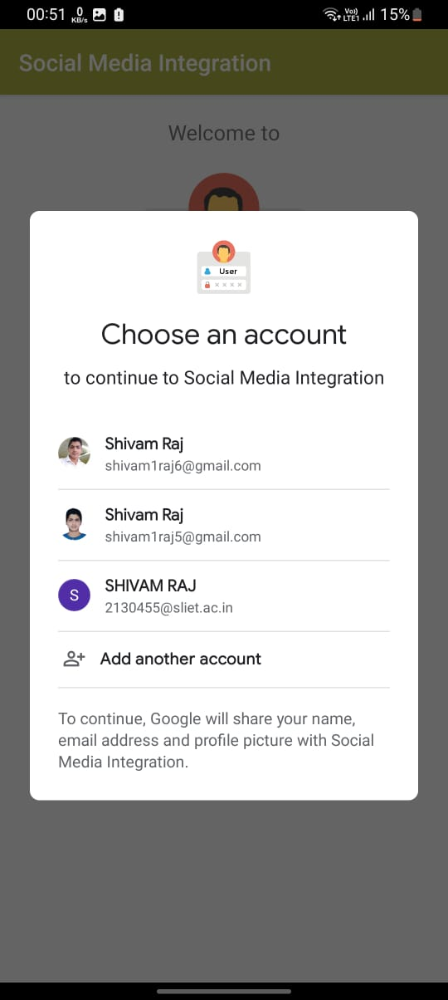
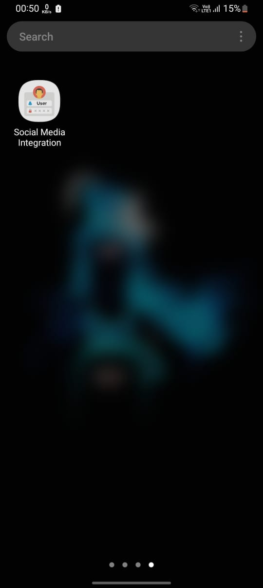

# Social_Media_Integration_JAVA

Features: 
Sign in through Facebook as well as Google. 
After login, it displays all the details (name, profile photo, and email) on the second page.

Integrations: 
Google sign in Integration 
Facebook Integration

https://github.com/shivam1raj5/Social_Media_Integration_JAVA/assets/57479532/de42addc-69c0-4b50-af89-9fd9c09c74dc

## 📷 Previews

